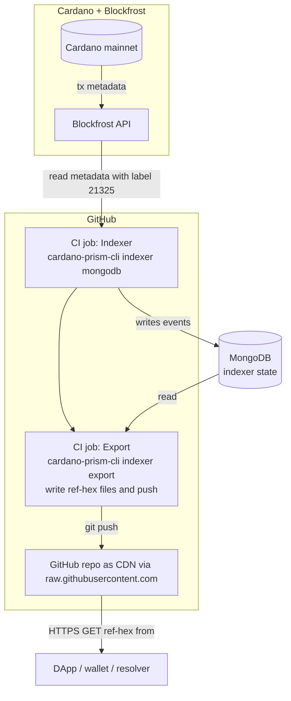

# prism-mainnet

A **trustless, read-only mirror of PRISM DID data on Cardano mainnet**, served as plain files from this GitHub repository so that DApps and lightweight clients can resolve PRISM entries without running their own indexer or trusting a third-party API.

## Why this exists

The [PRISM DID method](https://github.com/input-output-hk/prism-did-method-spec) anchors DID events as metadata on the Cardano blockchain. To resolve a PRISM DID, a client must scan Cardano transactions, find the relevant metadata, and verify each event. That's expensive for a browser DApp or a mobile wallet to do from scratch.

This repo solves the cost problem **without re-introducing trust**:

- The `refs/` folder contains one file per PRISM ref (named `<ref-hex>`), produced by the [`cardano-prism-cli`](https://github.com/FabioPinheiro/scala-did) indexer.
- Every entry is cryptographically anchored on Cardano. A client (or a paranoid auditor) can re-run the indexer themselves and reproduce the exact same `refs/` contents.
- GitHub serves the files via its CDN — fast, globally cached, no API key needed.

In short: **the data is verifiable, the hosting is incidental**. If this repo disappeared tomorrow, anyone could regenerate it from Cardano.

## Architecture



**Pipeline stages**

| Stage | Component | Role |
|---|---|---|
| Source of truth | Cardano mainnet | Immutable PRISM events as tx metadata. |
| Read API | Blockfrost | Queryable access to Cardano metadata (label 21325). |
| Indexer (CI) | GitHub Actions + MongoDB | Runs every 30 min, pulls new metadata, caches indexer state in Mongo for incremental runs. |
| Exporter (CI) | GitHub Actions | Writes `refs/<ref-hex>` and pushes to the repo. |
| Distribution | GitHub raw CDN | Serves `refs/` over HTTPS. |
| Consumer | DApp / wallet | Fetches a ref and verifies it locally. |

The indexer and exporter are the same `.github/workflows/ci.yml` job — two `cs launch` steps in one workflow.

## How to consume

Fetch a ref by its hex identifier:

```
https://raw.githubusercontent.com/FabioPinheiro/prism-mainnet/main/refs/<ref-hex>
```

Then verify the content client-side using the PRISM resolution rules. Don't skip the verify step — that's the whole point.

## Re-deriving the data yourself

If you don't want to trust this repo's hosting, run the same pipeline locally.

```bash
cs launch app.fmgp::cardano-prism-cli:$VERSION \
  -M fmgp.did.method.prism.cli.PrismCli -- \
  indexer mongodb --token <BLOCKFROST_KEY> <MONGODB_URI>

cs launch app.fmgp::cardano-prism-cli:$VERSION \
  -M fmgp.did.method.prism.cli.PrismCli -- \
  indexer export <MONGODB_URI> ./refs
```

The resulting `refs/` should match this repo byte-for-byte (modulo timing of the latest blocks).

## Related

- [`scala-did` / `cardano-prism-cli`](https://github.com/FabioPinheiro/scala-did) — the indexer/exporter implementation.
- [`prism-vdr`](https://github.com/FabioPinheiro/prism-vdr) — sibling old repo as PoC for (mainnet/ preview / preprod) data.
- [PRISM DID method spec](https://github.com/input-output-hk/prism-did-method-spec).
- [dApp Example - https://dapp.fabiopinheiro.com](https://dapp.fabiopinheiro.com)